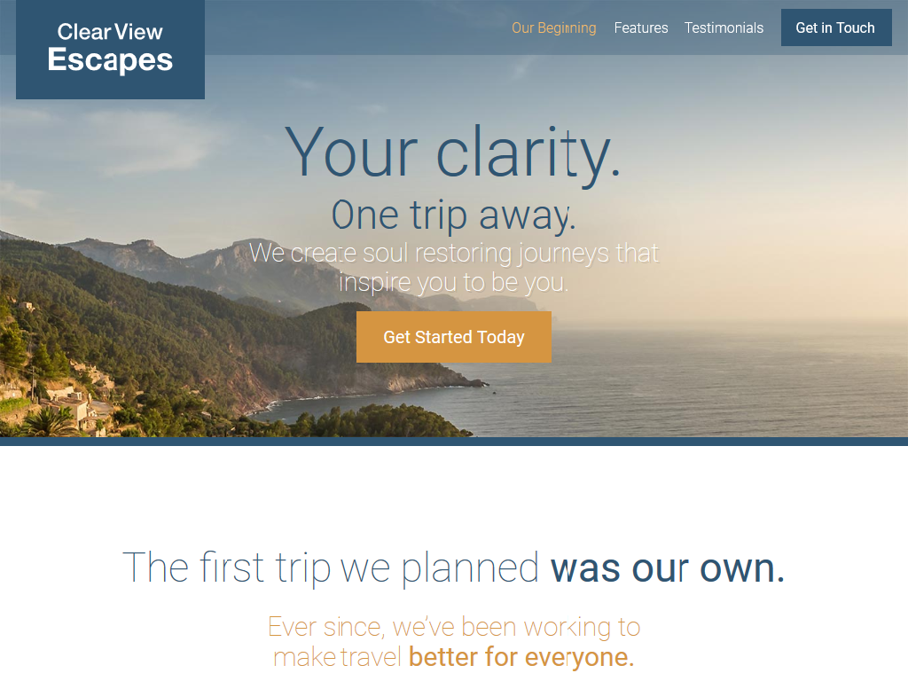

  
  
  

Project from my "Git a Web Developer Job: Mastering the Modern Workflow" course.  The project is a travel site build with Node.js, 
NPM, Object-oriented JavaScript, ES6, webpack, Gulp, BEM and a few other tools.

<a href="https://estronzaj.github.io/travel-site/"><i class="large play icon"></i>Live Preview - GitHub page</a> 

Source: <a href="https://github.com/estronzaj/travel-site"><i class="large github icon"></i>travel-site</a>

