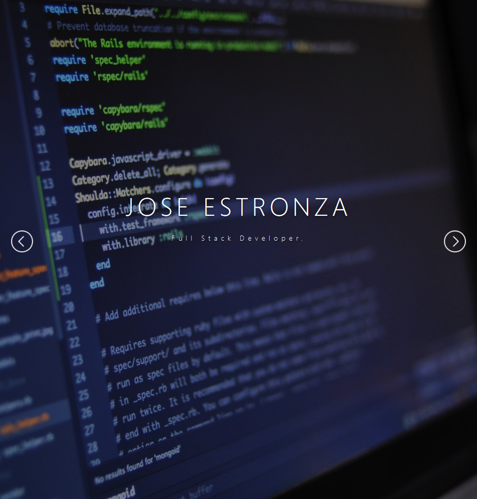
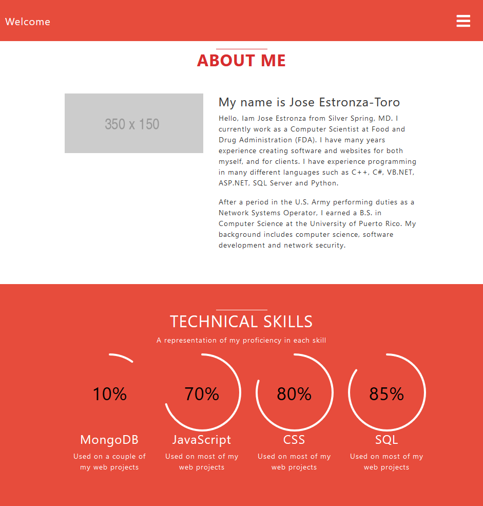
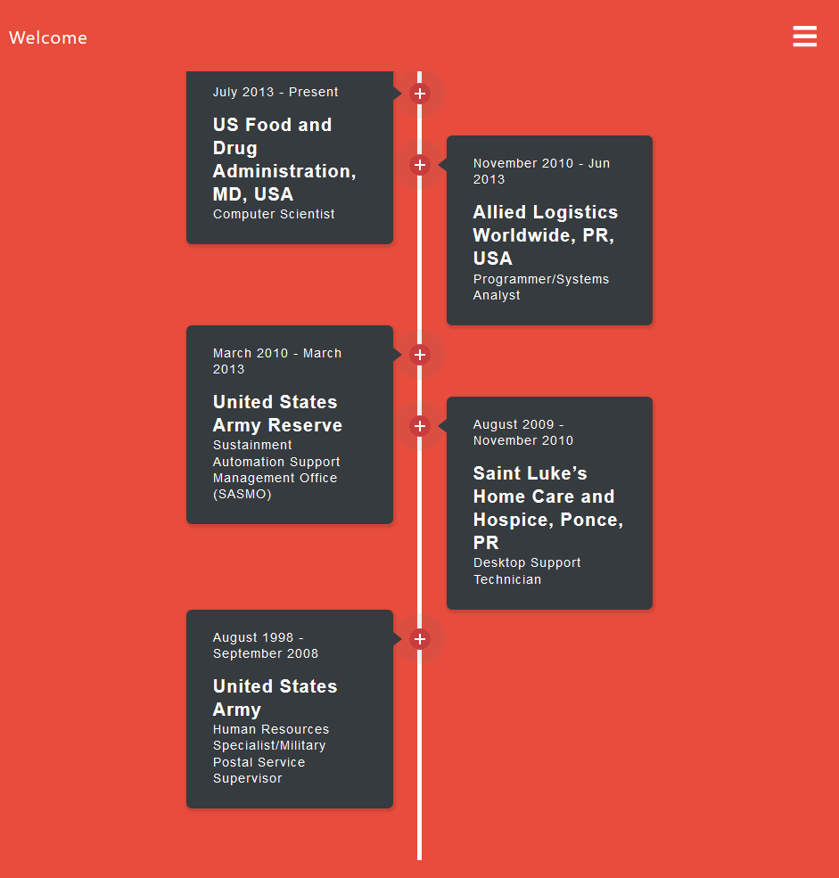

  
  
  

This project helped me learn how to design and implement a responsive web site.  I also gained experience with full-stack web application design and associated technologies, including third party tools like [Bootstrap](http://getbootstrap.com/) CSS Framework for the user interface, and Javascript for client programming. 

<a href="https://estronzaj.github.io/portfolio/"><i class="large play icon"></i>Live Preview - GitHub page</a> 

Source: <a href="https://github.com/estronzaj/portfolio"><i class="large github icon"></i>portfolio</a>